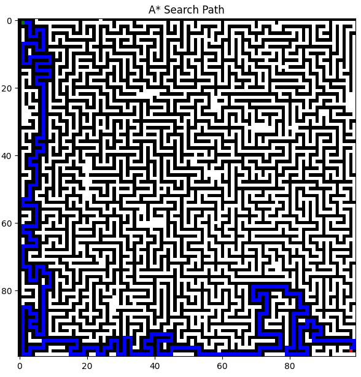
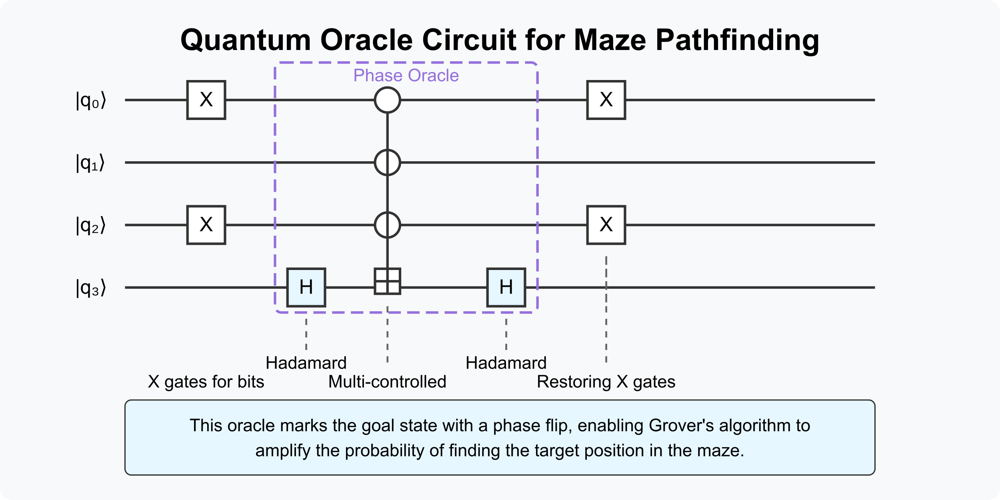
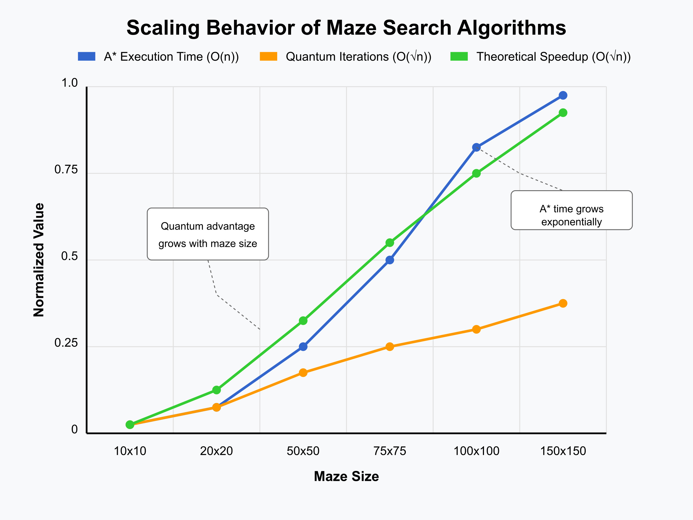

# Quantum Advantage in Maze Pathfinding 🚀🧠

This project compares classical A* search and quantum Grover's algorithm in solving maze pathfinding problems. It demonstrates the theoretical speedup Grover's algorithm provides, alongside practical challenges of quantum simulation on classical hardware.

## 🔍 Problem Statement
Classical pathfinding like A* struggles to scale with large, complex mazes. Quantum algorithms, especially Grover’s algorithm, offer potential speedups using O(√N) iterations. But how well does this translate into real results?

## 📌 What This Project Includes
- ✅ Maze generator with controlled complexity (Python)
- ✅ A* search implementation using Manhattan heuristic
- ✅ Grover's algorithm implementation via Qiskit
- ✅ Comparative performance analysis
- ✅ Visualizations of both algorithms
- ✅ Full research paper in PDF

## 📄 Research Paper
The full paper is available [here](paper/Quantum_Advantage_Maze_Pathfinding.pdf).

## 📊 Visual Samples

| Classical A* Path | Quantum Oracle Circuit | Scaling Graph |
|-------------------|------------------------|---------------|
|  |  |  |

## 🧪 Technologies Used
- Python 3.10
- Qiskit
- Matplotlib, NumPy
- Jupyter Notebooks

## 👨‍💻 Authors
- Abishek K  
- Danu Shri  
- Vishakan S  
- Kaushik G  
- Sriram M  

---

**Note**: Grover's simulation was run on classical hardware; results may differ significantly on real quantum processors.

